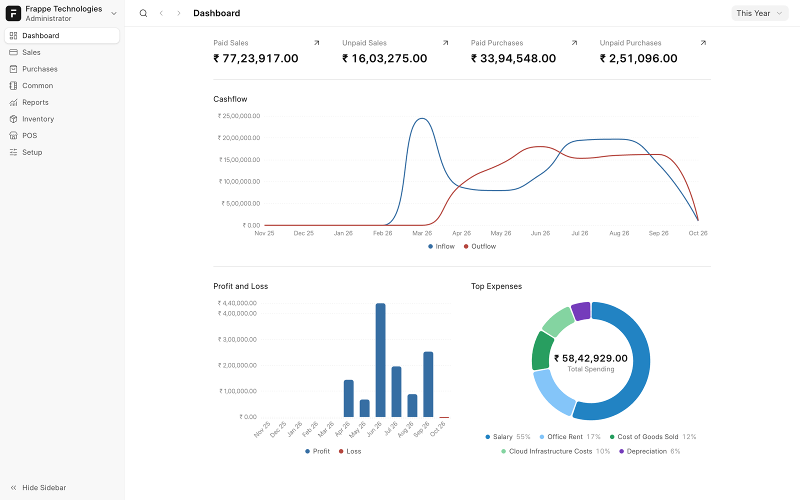
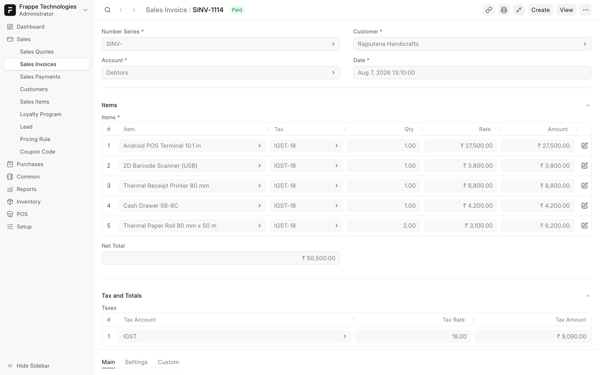
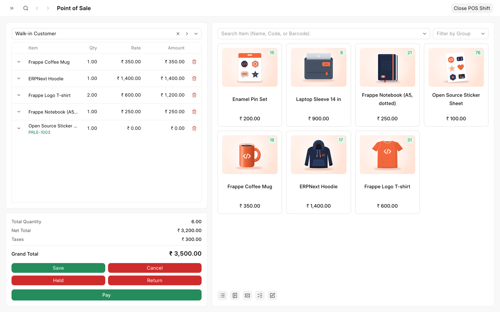
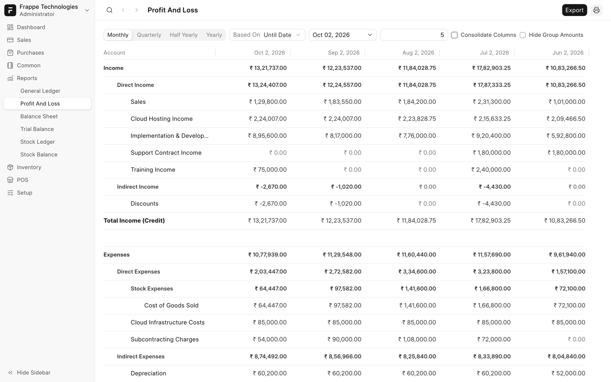
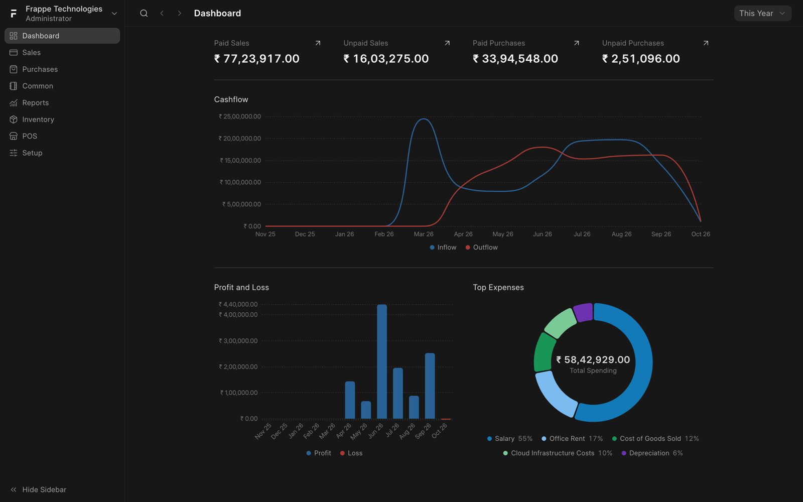
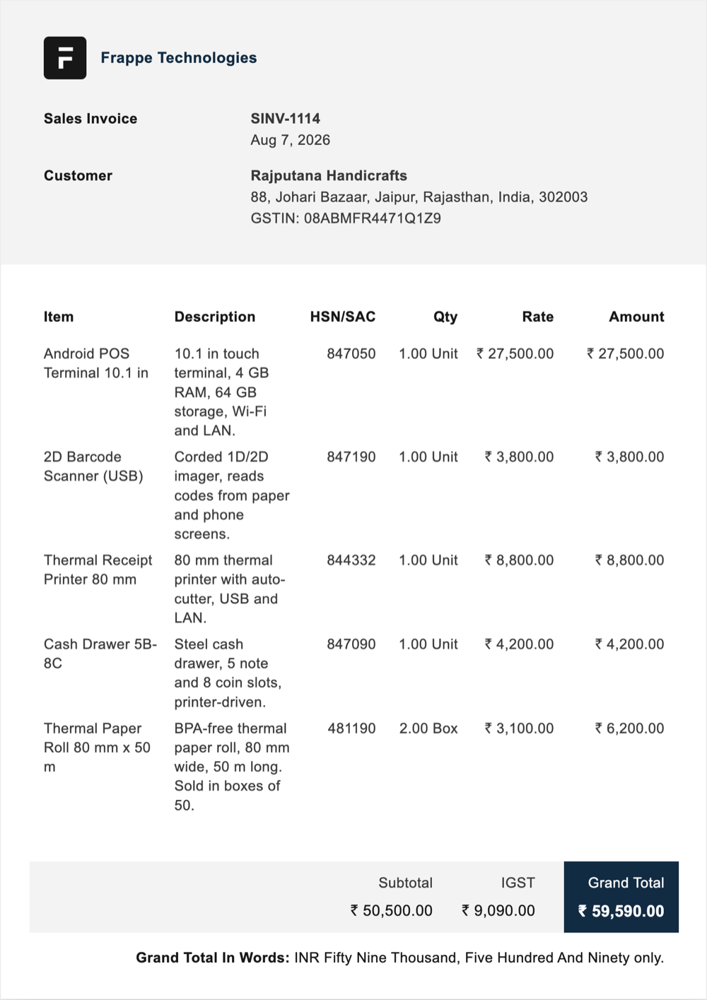
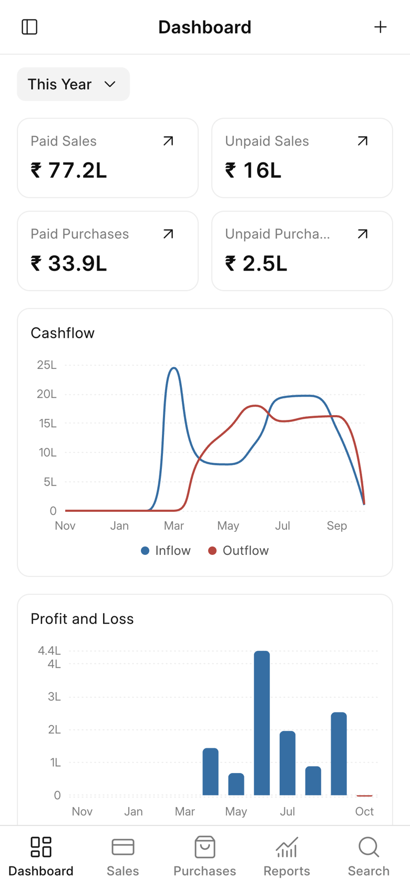
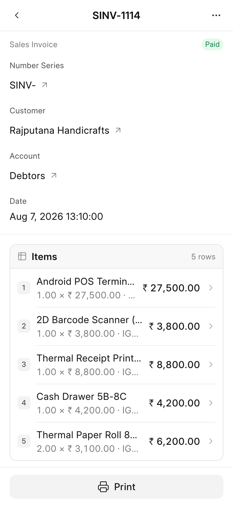
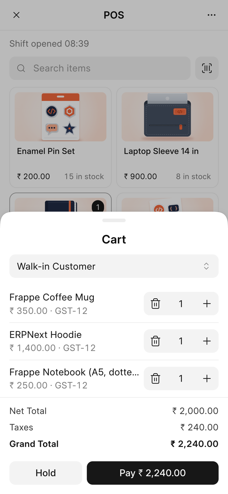
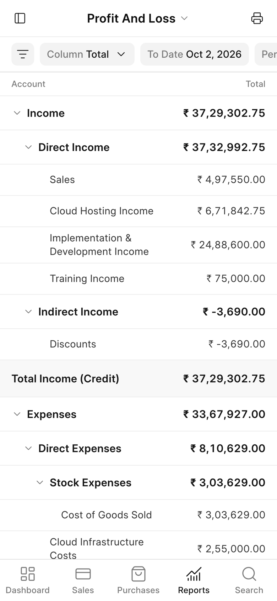

	
	<h2>Frappe Books</h2>
	
Modern Accounting Made Simple

	

	<a href="https://frappe.io/books">Website</a>
	-
	<a href="https://docs.frappe.io/books">Documentation</a>
	-
	<a href="https://github.com/frappe/books">Desktop App</a>

## Frappe Books

Open-source accounting for small businesses and freelancers, built on the Frappe Framework.

### Motivation

Frappe Books started as a desktop app that keeps one company in one file on one computer. This app puts the same Books interface on a Frappe site. Your team signs in from a browser on any computer or phone. Frappe controls users, roles, and permissions, and your data stays on your own server.

### Key Features

- **Accounting**: Double-entry ledger, chart of accounts, journal entries, and the General Ledger, Profit and Loss, Balance Sheet, and Trial Balance reports.
- **Sales and Purchases**: Quotes, invoices, payments, and returns, with a print format for each document.
- **Inventory**: Stock movements, shipments, receipts, batches, serial numbers, and FIFO valuation, with the Stock Ledger and Stock Balance reports.
- **Point of Sale**: POS shifts, checkout, barcode scanning, pricing rules, coupons, and loyalty points.
- **Phone App**: A phone layout with bottom tabs. Install it from the browser to your home screen.
- **Regional**: India GST with the GSTR-1 and GSTR-2 reports, Swiss fields, and translations for more than 15 languages.

	
	
	
	
	

### On Your Phone

<table align="center">
	<tr>
		<td></td>
		<td></td>
		<td></td>
		<td></td>
	</tr>
</table>

### Under the Hood

- [**Frappe Framework**](https://github.com/frappe/frappe): A full-stack web application framework written in Python and JavaScript. It gives Books its database layer, user authentication, permissions, and a REST API.

- [**Frappe UI**](https://github.com/frappe/frappe-ui): A Vue-based UI library for single-page apps on the Frappe Framework. The Books interface at `/books` uses its components on desktop and on phones.

## Learning and Community

1. [Documentation](https://docs.frappe.io/books): The user guide for Frappe Books.
2. [Telegram Group](https://t.me/frappebooks): Talk with other Frappe Books users.
3. [Frappe Forum](https://discuss.frappe.io): Ask questions about the Frappe Framework and its apps.

## Contributing

1. [Report an Issue](https://github.com/frappe/frappe-books/issues)
2. [Report a Security Vulnerability](https://frappe.io/security)

## License

[AGPL-3.0-only](license.txt)

 
 

	<a href="https://frappe.io" target="_blank">
		<picture>
			<source media="(prefers-color-scheme: dark)" srcset="https://frappe.io/files/Frappe-white.png">
			
		</picture>
	</a>

